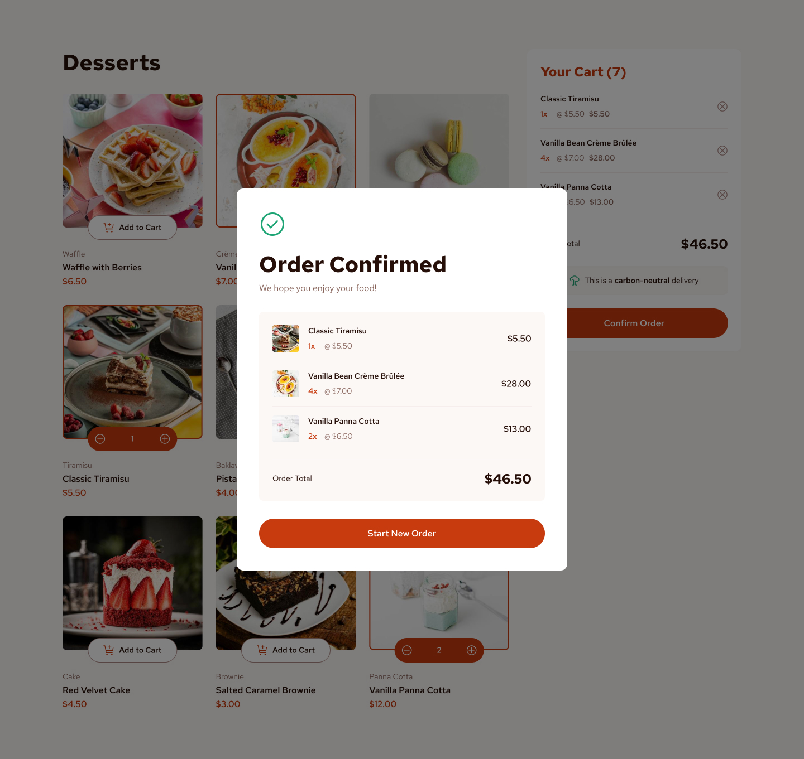

# Frontend Mentor — Product List with Cart

Solución al [challenge Product list with cart](https://www.frontendmentor.io/challenges/product-list-with-cart-5MmqLVAp_d) de Frontend Mentor, construida con React + TypeScript como proyecto de aprendizaje real.

## Tabla de contenidos

- [Overview](#overview)
- [Stack y decisiones técnicas](#stack-y-decisiones-técnicas)
- [Arquitectura](#arquitectura)
- [Lo que aprendí](#lo-que-aprendí)
- [Próximos pasos](#próximos-pasos)
- [Colaboración con IA](#colaboración-con-ia)
- [Autor](#autor)

---

## Overview

### El reto

Los usuarios pueden:

- Agregar productos al carrito y eliminarlos
- Aumentar / disminuir la cantidad de cada producto
- Ver el total de la orden en tiempo real
- Confirmar la orden desde un modal
- Resetear el carrito con "Start New Order"
- Ver el layout óptimo según el dispositivo (mobile / tablet / desktop)
- Ver estados hover y focus en todos los elementos interactivos

### Screenshot



### Links

- Repo: [github.com/FrancisoRocha/productListCartTS](https://github.com/FrancisoRocha/productListCartTS)
- Live: _próximamente_

---

## Stack y decisiones técnicas

- **React 18** + **TypeScript** — componentes, props, eventos
- **Vite** — bundler y dev server
- **CSS por componente** — cada componente tiene su propio `.css`, `index.css` solo tiene reset y variables globales
- **Custom hook `useCart`** — toda la lógica del carrito encapsulada y separada de la UI
- **Estado derivado** — `cartTotal` se calcula con `.reduce()` desde `items[]`, sin `useState`
- **Lifting state up** — `isModalOpen` vive en `App` por ser el ancestro común de `Cart` y `Modal`
- **Sin librerías de estado externas** — solo `useState` y props, intencional para aprender los fundamentos

---

## Arquitectura

```
App  ← useCart(), isModalOpen, handlers
├── Header
├── ProductGrid  ← products[], items[], handlers
│   └── ProductCard (× n)  ← product, quantity, onAddToCart, onIncrement, onDecrement
├── Cart  ← items[], cartTotal, onConfirmOrder, onRemoveFromCart
└── Modal  ← isOpen, items[], cartTotal, onStartNewOrder
```

**Flujo de datos:**
```
data.json → App → ProductGrid → ProductCard
useCart   → App → Cart
                → Modal
```

---

## Lo que aprendí

### Estado de UI vs Estado de dominio
No todo el estado pertenece al mismo lugar. `items[]` es estado de dominio (vive en `useCart`). `isModalOpen` es estado de UI (vive en el componente que lo controla). Mezclarlos viola la separación de responsabilidades.

### Lifting state up
El `useState` vive en el componente que necesita *controlarlo*, no en el que lo muestra. Si el estado viviera dentro del `Modal`, `Cart` no podría abrirlo.

### Shallow copy bug
`[...items]` copia el array pero los objetos internos siguen siendo referencias. Mutar `items[index].quantity += 1` muta el estado original. La solución es `.map()` para crear nuevos objetos:
```ts
items.map(item =>
  item.product.id === id
    ? { ...item, quantity: item.quantity + 1 }
    : item
)
```
### Persistencia con localStorage
El carrito se sincroniza con `localStorage` en cada cambio usando un `useEffect` que observa `items[]`. Al montar la app, se recupera el estado previo con una función de inicialización lazy en `useState`:
```ts
const [items, setItems] = useState<CartItem[]>(() => {
  const saved = localStorage.getItem('cart')
  return saved ? JSON.parse(saved) : []
})

useEffect(() => {
  localStorage.setItem('cart', JSON.stringify(items))
}, [items])
```
Esto garantiza que el carrito sobreviva recargas sin necesidad de librerías externas.


### Composición sobre mezcla en TypeScript
```ts
// ❌ mezcla campos — duplica datos
interface CartItem { id: string; name: string; quantity: number }

// ✅ composición — Product es un campo
interface CartItem {
  product: Product
  quantity: number
}
```

---

## Próximos pasos

- [x] Sprint 2 — Estilos completos y responsive design
- [x] Sprint 3 — Accesibilidad (keyboard nav, aria labels, focus states)
- [x] Sprint 4 — Persistencia con localStorage

---

## Colaboración con IA

Este proyecto se desarrolló con **Claude (Anthropic)** como mentor técnico, simulando un entorno real de trabajo:

- **Metodología:** Sprint planning, tickets en Linear, code reviews por cada componente
- **Rol de la IA:** Guía y revisión — no generó código directamente, sino que hizo preguntas para que yo pensara la solución
- **Herramientas integradas:** Linear (tickets), Notion (decisiones técnicas), GitHub (PRs y ramas)
- **Lo que aprendí del proceso:** Trabajar con un flujo profesional desde el inicio (branches, PRs, commits convencionales) hace la diferencia en cómo entiendes el código que escribes

---

## Autor

- GitHub — [@FrancisoRocha](https://github.com/FrancisoRocha)
- Frontend Mentor — [@FrancisoRocha](https://www.frontendmentor.io/profile/FrancisoRocha)
